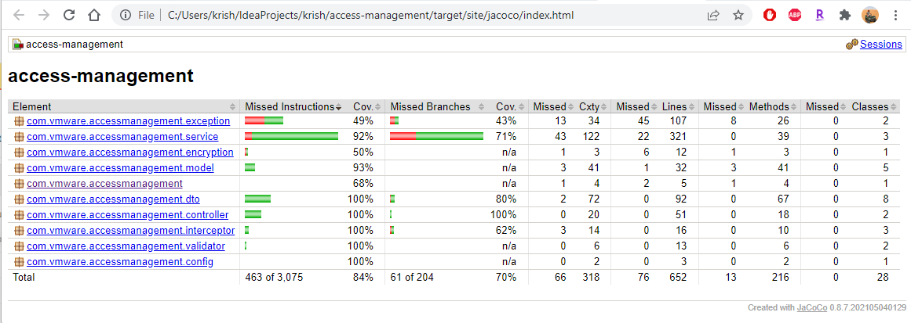

# Access Management API

Access Management API is a Rest based service that enables creating, updating and deleting users, groups and their relationships.


Using H2 database for temporary storage of data. Enabled encryption of sensitive data like `password` when saved to database.

* **Users API** can be accessed while service is running from [Users](http://localhost:8080/am/swagger-ui/index.html#/user-controller)
* **Groups API** can be accessed while service is running from [Groups](http://localhost:8080/am/swagger-ui/index.html#/group-controller)
* **API Schema** can be accessed while service is running from [Schema](http://localhost:8080/am/swagger-ui/index.html#/)

### Postman Collections
* **User** API --> Import user collection from `~.\User.postman_collection.json` into Postman
* **Group** API --> Import group collection from `~.\Group.postman_collection.json` into Postman

### Prerequisites
* **OpenJDK 17** or **later** versions can be downloaded from [JDK](https://jdk.java.net/17/)
* **Maven** 
* **Docker**
* **
Before proceeding to next steps, please verify prerequisites are installed/setup and accessible via cmd/terminal.

### Steps to Build/Test Access Management API
From cmd/terminal navigate to ~/access-management folder or can be built from Intellij, Eclipse or any other supported IDE.
* **Build** `mvn clean compile`
* **Unit/Integration Test** `mvn test`
* **Code Coverage Report** will be available under `~\target\site\jacoco\index.html` or [report](.\target\site\jacoco\index.html)
    <p align="left">
       
    </p>

* **

### Steps to Build and Run Access Management API
After installing/setting-up all prerequisites follow below steps to build and launch Access Management API Server in docker container.
* **Step 1** Clone latest code from [Access-Management](https://github.com/Krishna-Kolukuluri/access-management) GitHub repo
* **Step 2** From cmd/terminal navigate to ~/access-management folder and  Build code using `mvn clean install`
* **Step 3** From same folder run `docker-compose --file .\docker-compose.yml up -d --build`
* **
If all above steps are successful then 
* **API Server** will be available [api](http://localhost:8080/am/swagger-ui/index.html#/)
* **API Documentation** will be available [docs](http://localhost:8080/am/swagger-ui/index.html#/)
* **API Server Logs** will be available [logs](http://localhost:8080/am/actuator/logfile)
* **API Database** will be available [db](http://localhost:8080/am/h2-console/) change JDBC URL to `jdbc:h2:file:~/data/access-management.db`

### Steps to Stop and Remove running API Server containers
* **Step 1** `Docker ps` list all running containers
* **Step 2** Identify and get `containerid` from **Step 1** and run `docker stop containerid` to stop.
* **Step 2** Identify and get `containerid` from **Step 1** and run `docker rm containerid` to delete.

* **
<details><summary><b>Show Sample User Payload Messages</b></summary>

* **Note:** Create default Admin Group before testing `User API`.
* **Group** Payload sample json for creating group `/am/groups/createGroup` `POST`.


```json
    {
      "groupName": "ADMIN_ALL",
      "groupDescription": "Default ADMIN Group",
      "groupRole": "ADMIN",
      "groupPermission": "ALL"
    }
```
Response
```json
    {
        "httpStatus": "CREATED",
        "message": "Created Group with GroupName: 'ADMIN'",
        "status": true
    }
```


* **User** Payload sample json for creating user `/am/users/createUser` `POST`
```json
      {
        "firstName":"Krishna_Two",
        "lastName":"Krishna_Two",
        "userName":"Krishna_Two",
        "userRole":"ADMIN",
        "dob":"2010-12-14",
        "address":"111 Address Cary, NC",
        "password":"KrishnaKra@1234"
      }
```
Response
```json
    {
        "httpStatus": "CREATED",
        "message": "Created User with UserName: 'Krishna_Two'",
        "status": true
    }
```

* **User** Payload sample for all users `/am/users/all` `GET`
```json
    [
        {
            "firstName": "Krishna",
            "lastName": "Kolukuluri",
            "userName": "KrishnaWrite",
            "dob": "2010-12-13",
            "userRole": "NON_ADMIN",
            "address": "111 Address Cary, NC",
            "groups": [
                {
                    "groupName": "WRITE",
                    "groupDescription": "Default Read Group",
                    "groupRole": "NON_ADMIN",
                    "groupPermission": "WRITE"
                }
            ]
        },
        {
            "firstName": "KrishnaNewOne",
            "lastName": "KrishnaNewOne",
            "userName": "KrishnaNewOne",
            "dob": "2010-12-13",
            "userRole": "NON_ADMIN",
            "address": "111 Address Cary, NC",
            "groups": []
        }
    ]
```
* **User** Payload sample for single user `/am/users/KrishnaNewOne` `GET`
```json
    {
        "firstName": "KrishnaNewOne",
        "lastName": "KrishnaNewOne",
        "userName": "KrishnaNewOne",
        "dob": "2010-12-13",
        "userRole": "NON_ADMIN",
        "address": "111 Address Cary, NC",
        "groups": []
    }
```
* **User** Payload sample for delete user `/am/users/KrishnaWrite` `DELETE`
```json
    {
        "httpStatus": "OK",
        "message": "User found and deleted.",
        "status": true
    }
```
* **User** Payload sample for update user `/am/users/KrishnaNewOne` `PUT`
```json

    {
      "firstName": "KrishnaNewOne",
      "lastName": "KrishnaNewOne",
      "userRole": "NON_ADMIN",
      "dob": "2010-12-14",
      "address": "111 Address Cary, NC",
      "password": "Krishna@12"
    }
```
Response
```json
    {
        "firstName": "KrishnaNewOne",
        "lastName": "KrishnaNewOne",
        "userName": "KrishnaNewOne",
        "dob": "2010-12-14",
        "userRole": "NON_ADMIN",
        "address": "111 Address Cary, NC",
        "groups": [
            {
                "groupName": "READ",
                "groupDescription": "Default Read Only Group Updated groupDescription",
                "groupRole": "NON_ADMIN",
                "groupPermission": "READ"
            }
        ]
    }
```
* **User** Payload sample for add groups to user `/am/users/KrishnaNewOne/groups/add` `POST`
```json
    [
        {
         "groupName": "READ"
        },
        {
         "groupName": "WRITE"
        }
        ,
        {
         "groupName": "NONE"
        }
    ]
```
Response:
```json
    {
        "firstName": "KrishnaNewOne",
        "lastName": "KrishnaNewOne",
        "userName": "KrishnaNewOne",
        "dob": "2010-12-14",
        "userRole": "NON_ADMIN",
        "address": "1234 Dreamvalley, NoMansLand, Space",
        "groups": [
            {
                "groupDescription": "Default Read Group",
                "groupName": "READ",
                "groupRole": "NON_ADMIN",
                "groupPermission": "READ"
            },
            {
                "groupDescription": "Default Read Group",
                "groupName": "WRITE",
                "groupRole": "NON_ADMIN",
                "groupPermission": "WRITE"
            },
            {
                "groupDescription": "Default None Group",
                "groupName": "NONE",
                "groupRole": "NON_ADMIN",
                "groupPermission": "NONE"
            }
        ]
    }
```
* **User** Payload sample for delete groups from user `/am/users/KrishnaNewOne/groups/delete` `DELETE`
```json
    [
      {
        "groupName": "READ"
      }
    ]
```
Response
```json
    {
        "firstName": "KrishnaNewOne",
        "lastName": "KrishnaNewOne",
        "userName": "KrishnaNewOne",
        "dob": "2010-12-14",
        "userRole": "NON_ADMIN",
        "address": "1234 Dreamvalley, NoMansLand, Space",
        "groups": [
            {
                "groupDescription": "Default Read Group",
                "groupName": "WRITE",
                "groupRole": "NON_ADMIN",
                "groupPermission": "WRITE"
            },
            {
                "groupDescription": "Default None Group",
                "groupName": "NONE",
                "groupRole": "NON_ADMIN",
                "groupPermission": "NONE"
            }
        ]
    }

```
</details>

* **

<details><summary><b>Show Sample Group Payload Messages</b></summary>

* **Group** Payload sample json for creating group `/am/groups/createGroup` `POST`

```json
    {
      "groupName": "WRITE",
      "groupDescription": "Default Read Group",
      "groupRole": "NON_ADMIN",
      "groupPermission": "WRITE"
    }
```
Response
```json
    {
        "httpStatus": "CREATED",
        "message": "Created Group with GroupName: 'WRITE'",
        "status": true
    }
```
* **Group** Payload sample json for get group with users `/am/groups/WRITE` `GET`

```json
    {
        "groupName": "WRITE",
        "groupDescription": "Default Read Group",
        "groupRole": "NON_ADMIN",
        "groupPermission": "WRITE",
        "users": [
            {
                "firstName": "Krishna",
                "lastName": "Kolukuluri",
                "userName": "KrishnaWrite",
                "userRole": "NON_ADMIN"
            }
        ]
    }
```

* **Group** Payload sample json for get all group `/am/groups/all` `GET`

```json
    [
        {
            "groupName": "READ",
            "groupDescription": "Default Read Group",
            "groupRole": "NON_ADMIN",
            "groupPermission": "READ"
        },
        {
            "groupName": "WRITE",
            "groupDescription": "Default Read Group",
            "groupRole": "NON_ADMIN",
            "groupPermission": "WRITE"
        },
        {
            "groupName": "NONE",
            "groupDescription": "Default None Group",
            "groupRole": "NON_ADMIN",
            "groupPermission": "NONE"
        },
        {
            "groupName": "ADMIN_ALL",
            "groupDescription": "Default Admin Group, Not be deleted",
            "groupRole": "ADMIN",
            "groupPermission": "ALL"
        }
    ]
```

* **Group** Payload sample json for delete group `/am/groups/WRITE` `DELETE`

```json
    {
        "httpStatus": "OK",
        "message": "WRITE Group found and deleted",
        "status": true
    }
```

* **Group** Payload sample json for update group `/am/groups/READ` `PUT`

```json
    {
      "groupDescription": "Default Read Only Group Updated groupDescription"
    }
```
Response
```json
    {
        "httpStatus": "OK",
        "message": "Updated Group: 'READ'",
        "status": true
    }
```
* **Group** Payload sample json for add users to group `/am/groups/WRITE/users/add` `POST`
```json
    [
        "Krishna_Two",
        "KrishnaRead"
    ]
```
Response
```json
    {
        "httpStatus": "OK",
        "message": "Added available users to Group: 'WRITE'",
        "status": true
    }
```
* **Group** Payload sample json for delete users from group `/am/groups/WRITE/users/delete` `DELETE`
```json
    [
        "Krishna_Two"
    ]
```
Response
```json
    {
        "httpStatus": "OK",
        "message": "Deleted available users from Group: 'WRITE'",
        "status": true
    }
```
</details>

* **